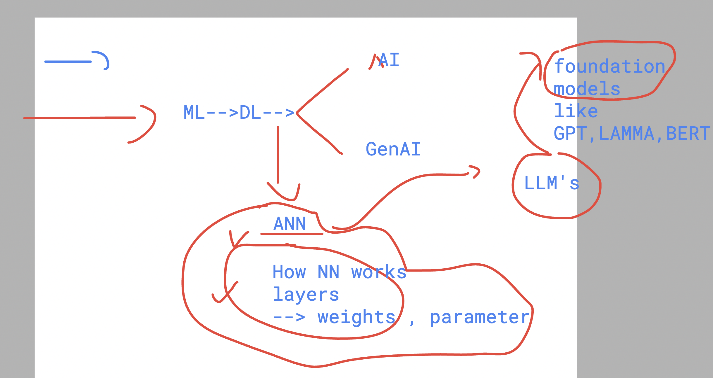
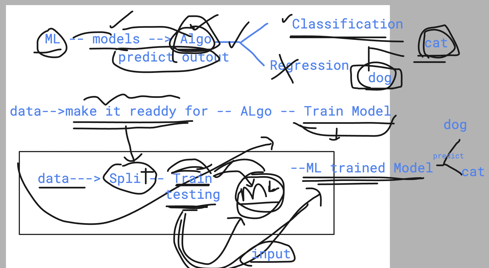
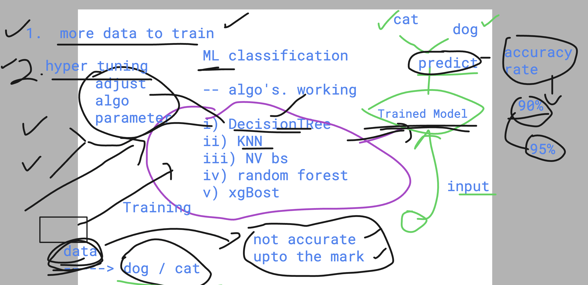
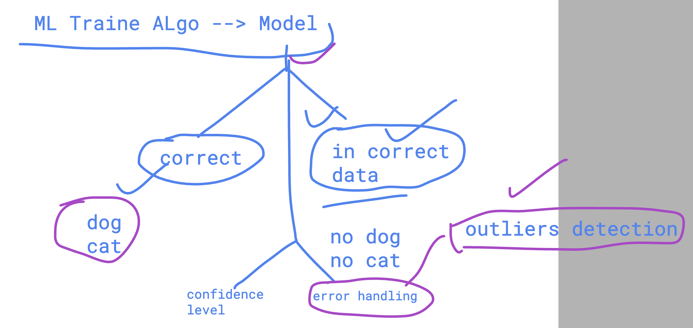
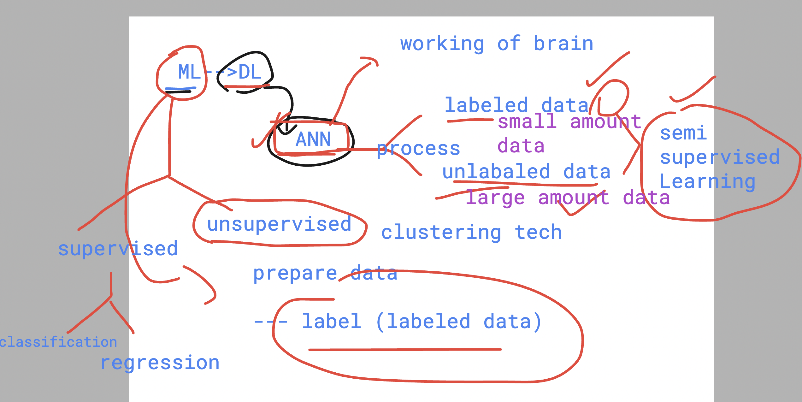
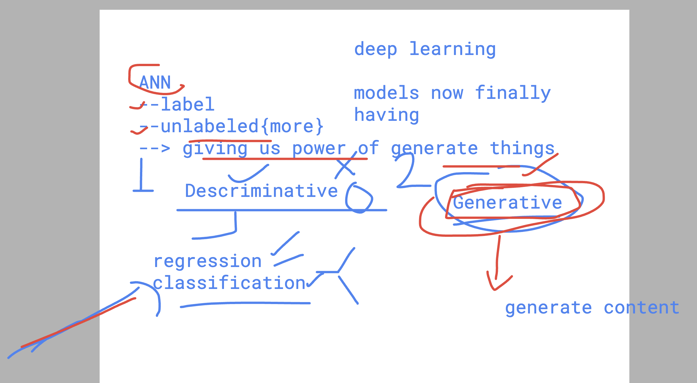

## Setting the context 

### ML flow understanding for Classification 

### more understanding about ML model tune 

### error handling in ML Models

## Understanding few points about ANN 

### predictive and Generative 

