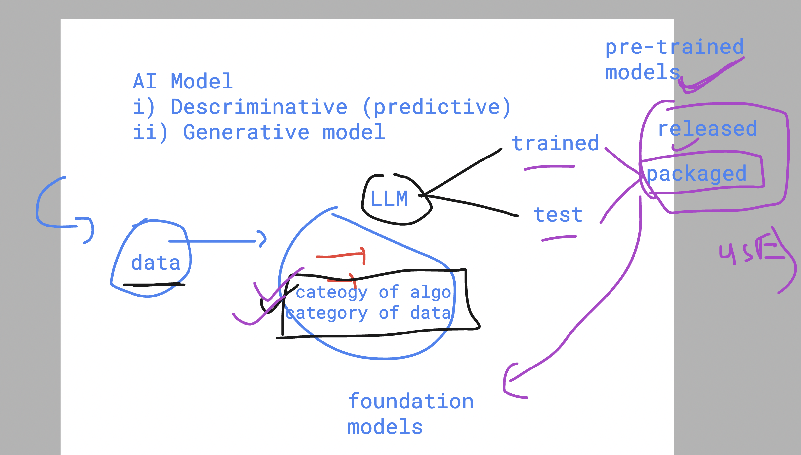
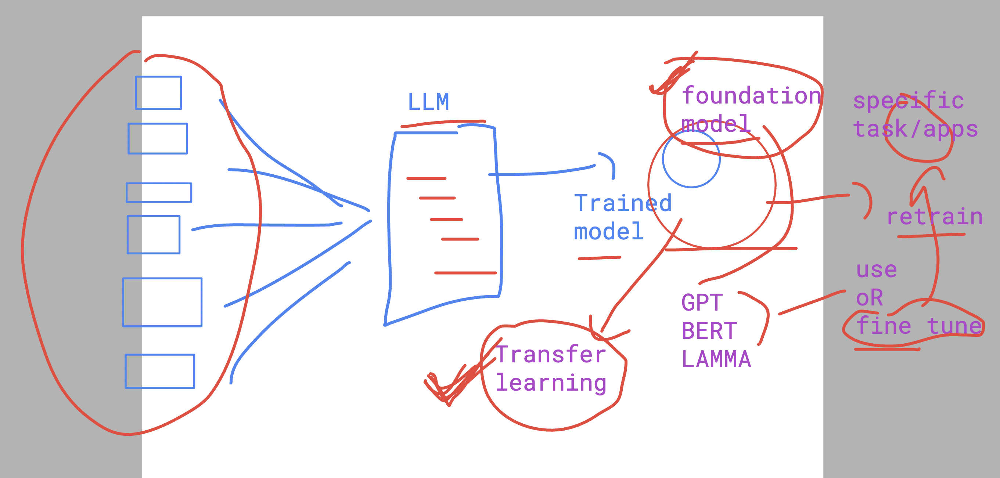
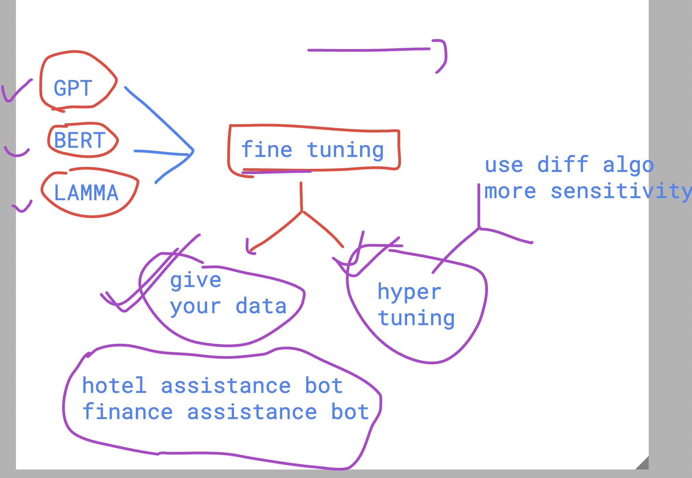
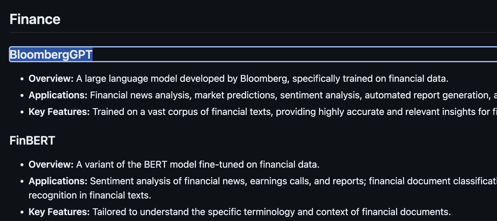
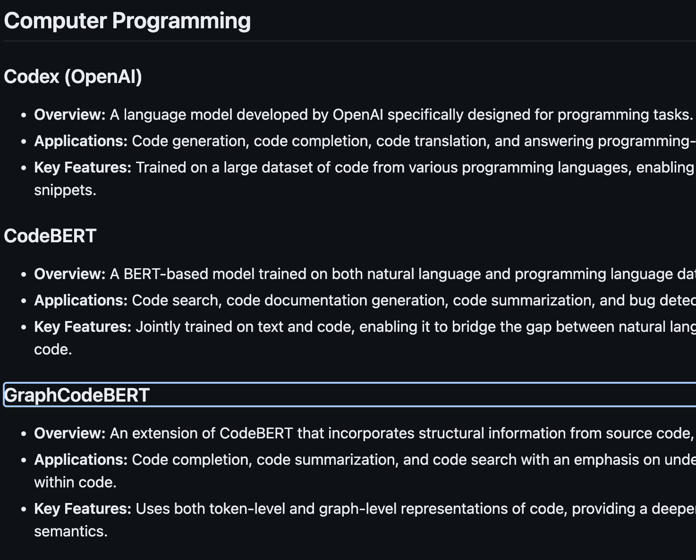
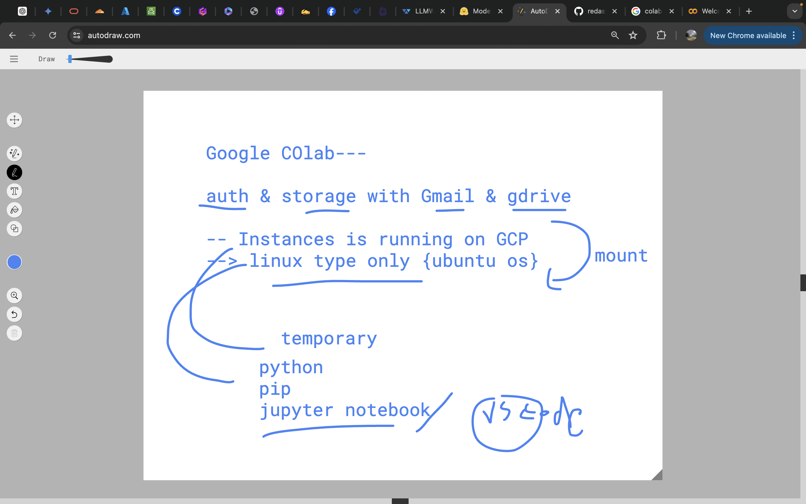
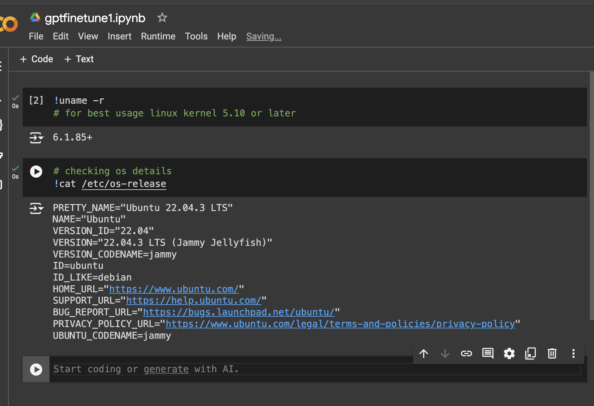

## Setting the context 

### ML flow understanding for Classification 

### more understanding about ML model tune 

### error handling in ML Models

## Understanding few points about ANN 

### predictive and Generative 

### Intro to foundation models 

### more about foundation models and transfer learning usage 

### fine tuning to foundation models 

## Domain Specific foundation models

### finance models 

### computer programming 

## Lab 

### using google colab 

## in colab to run any os specific commands use !

## lets fine tune -- GPT foundation model --created by  OpenAI

[click_here](https://platform.openai.com/docs/guides/fine-tuning)

