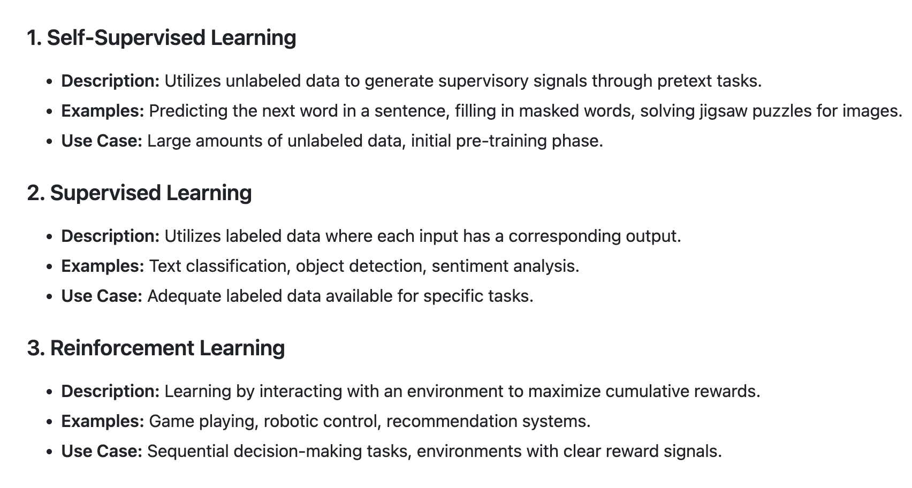
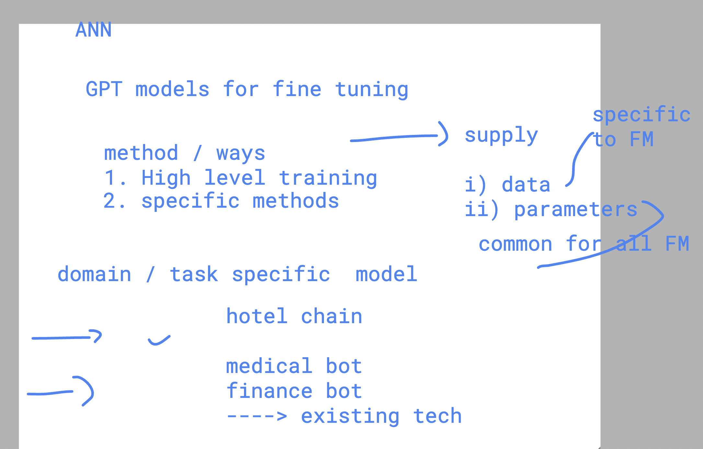
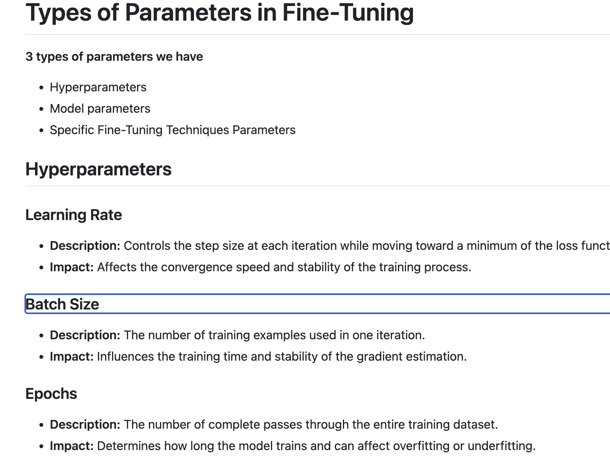
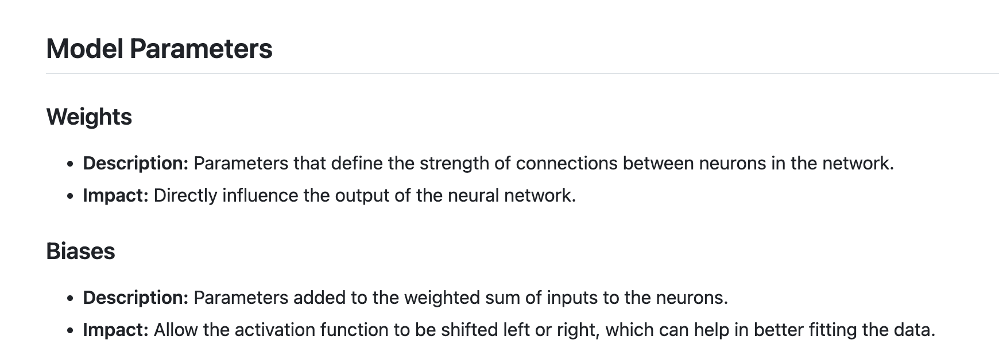
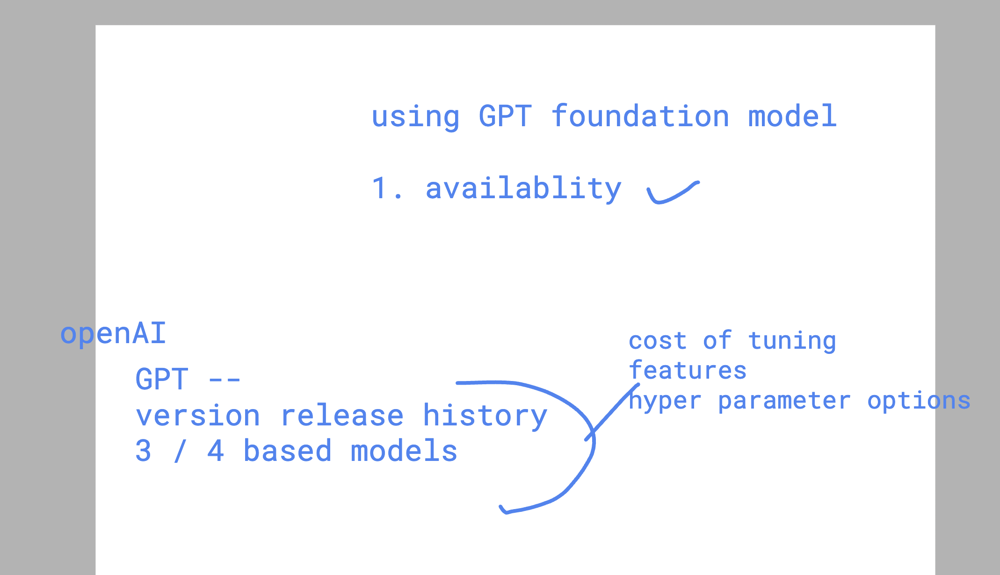
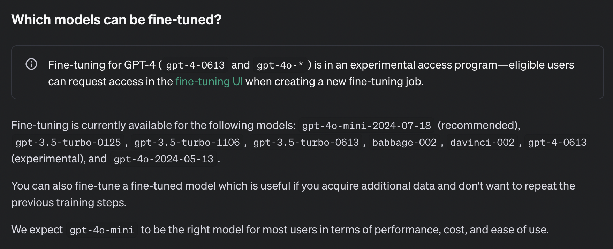

# fine tuning GPT foundation model 

### high level methods for fine tuning 



###  to fine tune any model we have to supply 2 things at bare minimum 

- data
- parameters



### parameters 




### model parameters



### overall understanding 


## GPT things 

### model release understanding 




### model to fine tune



### data message format 

```
# data model format for GPT 
# ROle specific 
# we have to prepara training data with few examples  
# single sample data 1 data of example 
{
    "messages": [
        { "role": "system" , "content": "my hotel bot which is helping customer untill they are not satified" },
        { "role": "user" , "content": "i can't find wifi password" },
        { "role": "assistant" , "content": "hey sorry for inconvience but wifi passsword you have to just ask at reception" }
    ],
    "messages": [
        { "role": "system" , "content": "my hotel bot which is helping customer untill they are not satified" },
        { "role": "user" , "content": "i need to order food where is the menu " },
        { "role": "assistant" , "content": "there must be a table in you room check there else please call 9 extension" }
    ]
}
```

