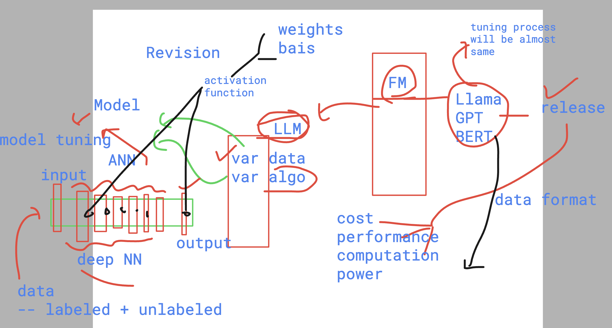
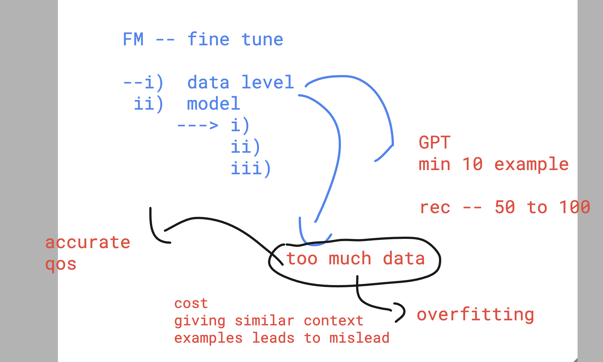
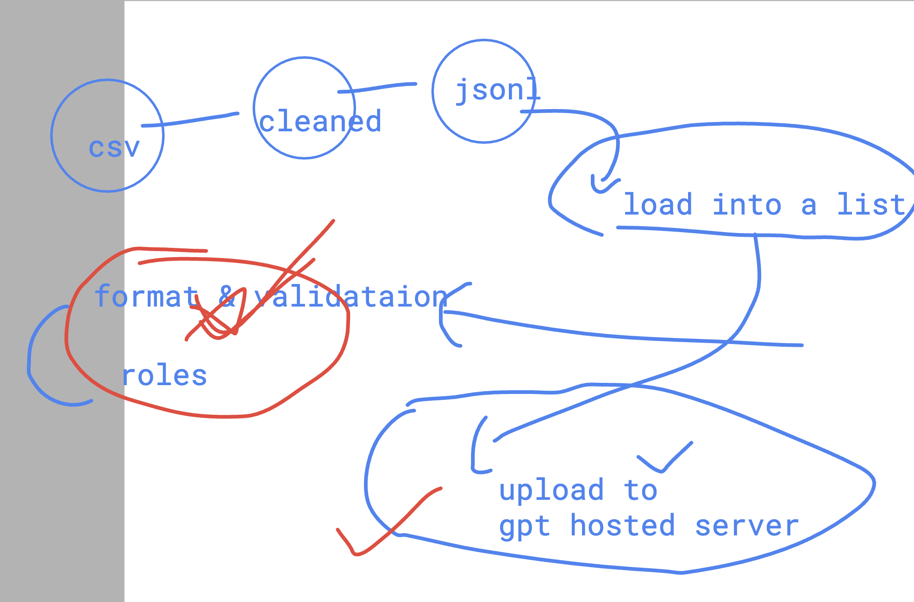
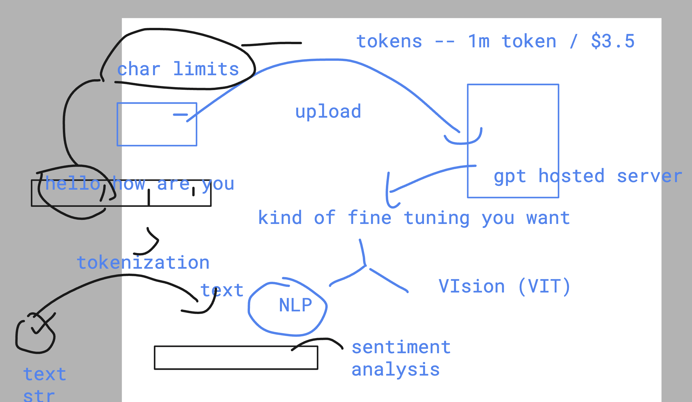
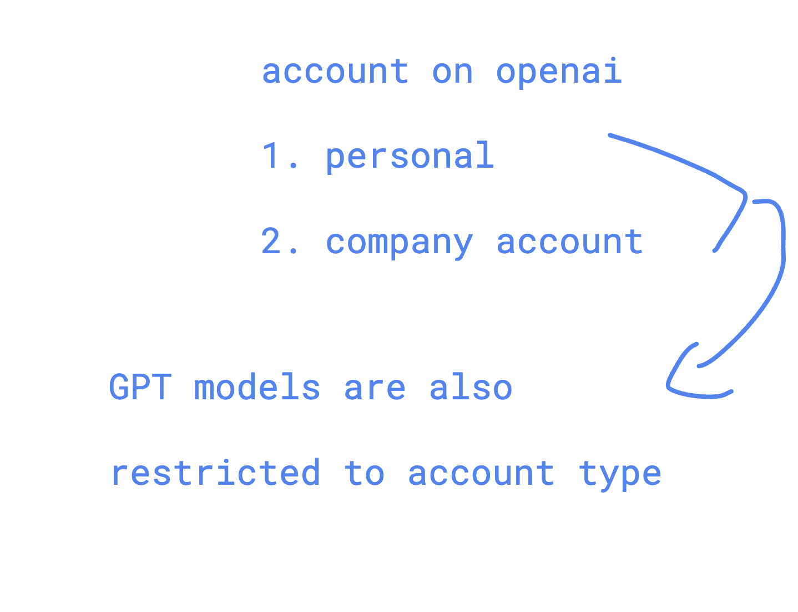
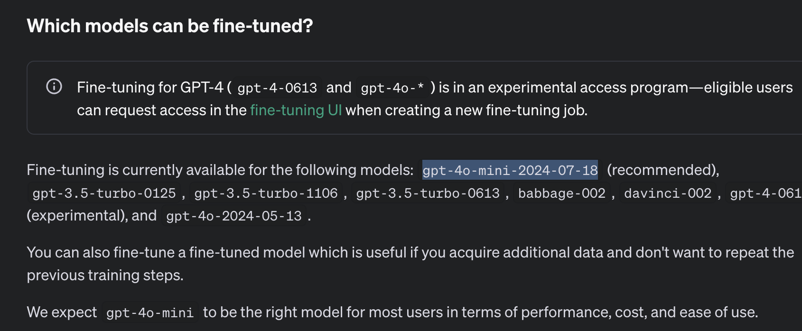
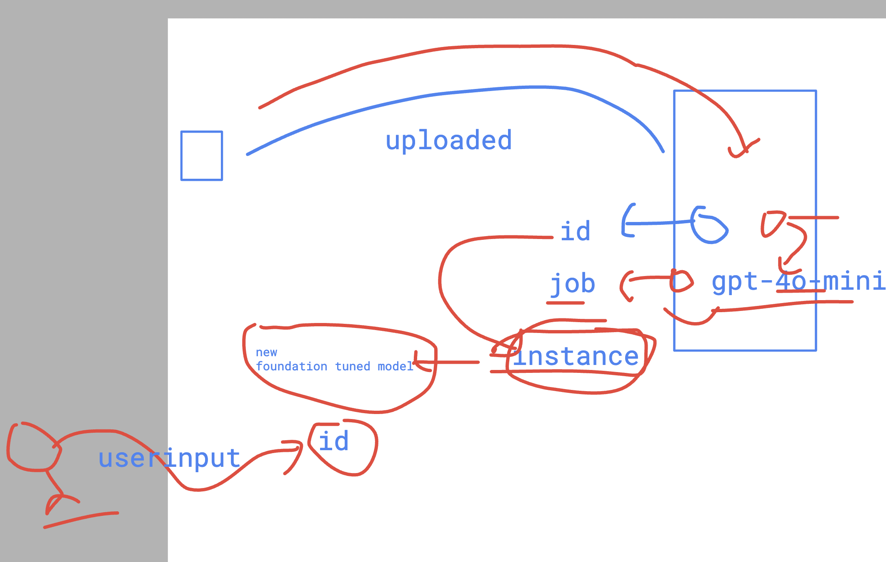
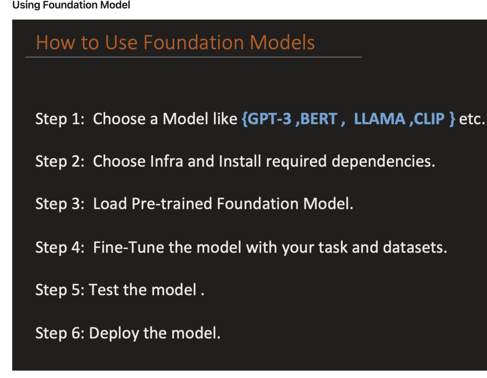
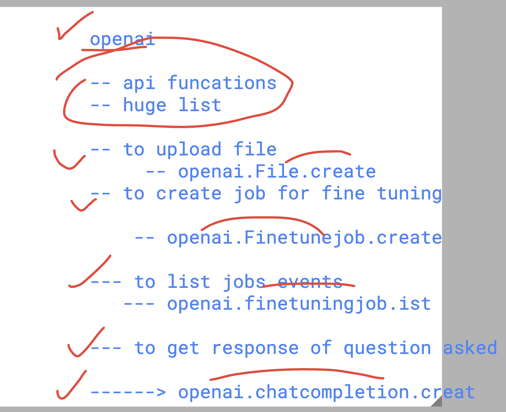

## Revision and understaing 

### giving too much data example 

## openai cookbook community 

### URL of community 

[click_here](https://cookbook.openai.com/)

### URL of data pre-processing for chat assitance in gpt model 

[click_here](https://cookbook.openai.com/examples/chat_finetuning_data_prep)

## process of fine tuning FM for GPT 

### fine tuning pricing as per token basis

### openai account types 

### available gpt models for fine tuning 

### model training 

## fine tune FM process 

### more info abut fine gpt openai -- libs

